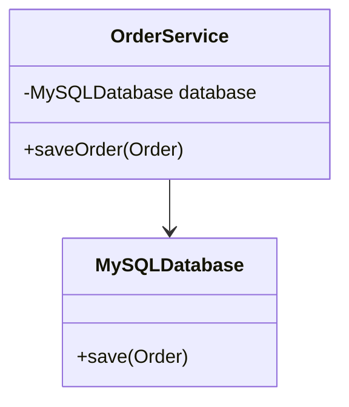
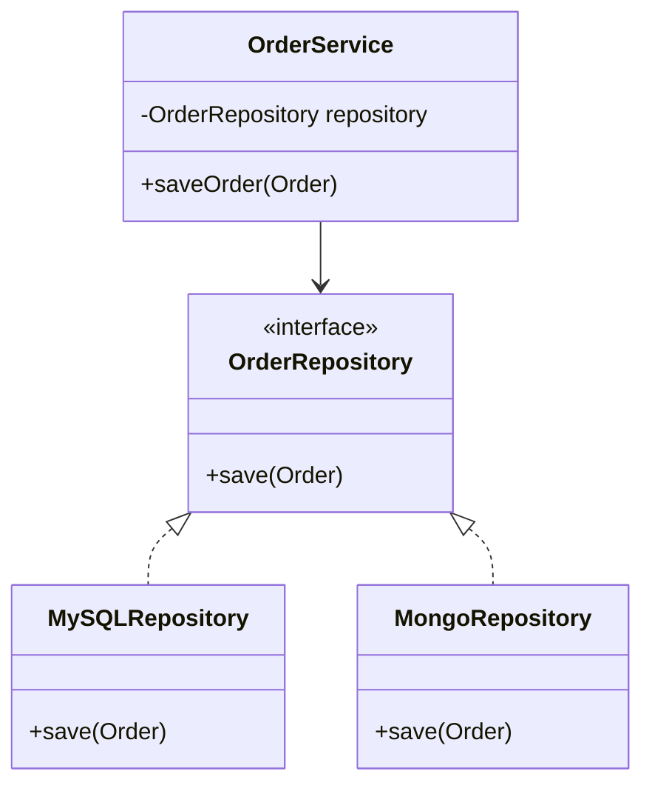

# Dependency Inversion Principle Example

## Bad Design (Violating DIP)

- High-level module (OrderService) depends directly on low-level module (MySQLDatabase)
- Changes to database implementation require changes to OrderService
- Tightly coupled design

## Good Design (Following DIP)

- High-level module (OrderService) depends on abstraction (OrderRepository)
- Low-level modules implement the abstraction
- Loose coupling allows easy switching between implementations
- Both high-level and low-level modules depend on abstractions
