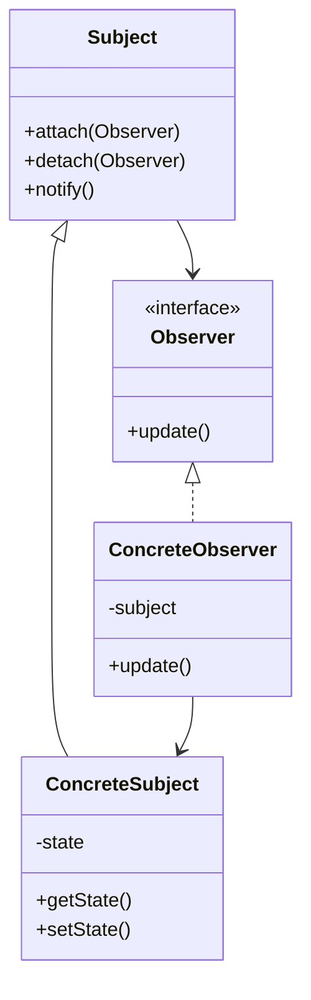

# Observer Pattern Structure

- **Key Components**:
    1. Subject (Observable)
        - Knows its observers
        - Provides interface for attaching/detaching observers
    2. Observer
        - Defines updating interface for objects
    3. ConcreteSubject
        - Stores state of interest to observers
        - Sends notifications to observers
    4. ConcreteObserver
        - Maintains reference to concrete subject
        - Implements Observer updating interface
